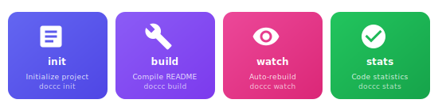
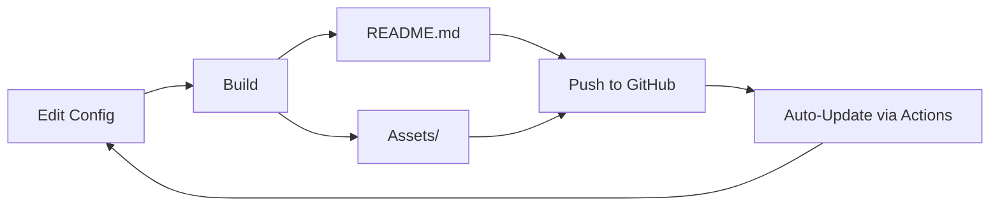

<!-- doccc README - Auto-generated with maximum interactivity -->
<!-- This README demonstrates all interactive features possible on GitHub -->

<div align="center">

<!-- Animated Hero with Dark/Light Mode Support -->
<picture>
  <source media="(prefers-color-scheme: dark)" srcset="assets/hero-dark.svg">
  <source media="(prefers-color-scheme: light)" srcset="assets/hero.svg">
  
</picture>

<br><br>

<!-- Interactive Navigation Bar -->
<a href="#features"></a>
<a href="#installation"></a>
<a href="#code-stats"></a>
<a href="#usage"></a>
<a href="#api"></a>

<br><br>

<!-- Live Status Badges with Animations (from linehook) -->
<p>


</p>

<!-- Standard Badges -->
<p>
<a href="https://www.npmjs.com/package/doccc"></a>
<a href="LICENSE"></a>
<a href="https://nodejs.org"></a>
<a href="https://github.com/NagusameCS/doccc/stargazers"></a>
</p>

<br>

**Transform your README into a dynamic, visually rich website—compiled at build time, 100% GitHub-safe.**

<br>

<!-- Call-to-Action Buttons -->
<a href="#installation">
  
</a>
&nbsp;&nbsp;
<a href="https://github.com/NagusameCS/doccc">
  
</a>

</div>

<br>

---

<br>

## Features

<!-- Animated Feature Cards -->
<div align="center">

</div>

<br>

<table>
<tr>
<td width="50%">

### Visual Component System

- **Hero Headers** with animated SVGs
- **Feature Grids** with responsive layouts
- **Stats Panels** powered by linehook
- **FAQ Sections** with collapsible details
- **Timeline/Roadmap** visualizations
- **Contributor Galleries** with avatars

</td>
<td width="50%">

### linehook Integration

- **Live Code Statistics** - lines, files, languages
- **Animated Badges** - pulse, count-up effects
- **Language Charts** - pie, bar, treemap
- **Dashboard Views** - comprehensive stats
- **Auto-Regeneration** - via GitHub Actions

</td>
</tr>
<tr>
<td>

### knowtif Notifications

- **Push Alerts** - code changes
- **Release Notifications** - new versions
- **Webhook Support** - Discord, Slack
- **Email Integration** - SMTP support
- **Custom Events** - stars, forks, issues

</td>
<td>

### Build-Time Magic

- **Zero Runtime JS** - pure markdown output
- **Dark/Light Mode** - automatic switching
- **GitHub Actions** - scheduled updates
- **Asset Generation** - SVGs, images
- **100% GitHub Safe** - no blocked content

</td>
</tr>
</table>

<br>

---

<br>

## Code Stats

<!-- Live Statistics from linehook - Auto-regenerated via GitHub Actions -->
<div align="center">

<!-- Summary Card - Generated by linehook -->


<br><br>

<!-- Language Breakdown Chart -->


<br><br>

<!-- Dashboard Components -->
<table>
<tr>
<td align="center">

<br><sub>Language Distribution</sub>
</td>
</tr>
</table>

<br>

<!-- Quick Stats Row - Animated Badges -->
<table>
<tr>
<td align="center"><b>Files</b><br></td>
<td align="center"><b>Lines</b><br></td>
<td align="center"><b>Code</b><br></td>
<td align="center"><b>Chars</b><br></td>
</tr>
</table>

<br>

<!-- All linehook Badges -->
<details>
<summary><b>View All Statistics Badges</b></summary>
<br>
<p>


</p>

These badges are auto-updated via GitHub Actions on push!

</details>

</div>

<br>

---

<br>

## Installation

<div align="center">

</div>

<br>

<table>
<tr>
<td width="33%" align="center">

**npm**
```bash
npm install -g doccc
```

</td>
<td width="33%" align="center">

**yarn**
```bash
yarn global add doccc
```

</td>
<td width="33%" align="center">

**pnpm**
```bash
pnpm add -g doccc
```

</td>
</tr>
</table>

<br>

<details>
<summary><b>Prerequisites</b></summary>
<br>

- **Node.js** >= 18.0.0
- **npm**, **yarn**, or **pnpm**
- A GitHub repository (for full features)

</details>

<details>
<summary><b>Optional Dependencies</b></summary>
<br>

```bash
# For enhanced code statistics
npm install -g linehook

# For GitHub notifications
npm install -g knowtif
```

</details>

<br>

---

<br>

## Usage

<!-- Animated Build Pipeline -->
<div align="center">

</div>

<br>

### Quick Start

```bash
# 1. Initialize a new project
doccc init

# 2. Customize your config
code doccc.config.js

# 3. Build your README
doccc build

# 4. Watch for changes (development)
doccc watch
```

<br>

<!-- Interactive Workflow Cards -->
<div align="center">

</div>

<br>

### Interactive Workflow



<br>

### CLI Commands

<details open>
<summary><b>Core Commands</b></summary>
<br>

| Command | Description |
|---------|-------------|
| `doccc init` | Initialize new project with interactive setup |
| `doccc build` | Compile README from configuration |
| `doccc watch` | Auto-rebuild on file changes |
| `doccc preview` | Local preview server with hot reload |

</details>

<details>
<summary><b>Statistics Commands</b></summary>
<br>

| Command | Description |
|---------|-------------|
| `doccc stats` | Generate code statistics |
| `doccc stats --format badge` | Output as SVG badges |
| `doccc stats --format svg` | Output as chart SVGs |
| `doccc stats --format json` | Output raw JSON data |

</details>

<details>
<summary><b>Notification Commands</b></summary>
<br>

| Command | Description |
|---------|-------------|
| `doccc notify --setup` | Interactive notification setup |
| `doccc notify --test` | Send test notification |
| `doccc notify --events push,release` | Configure event types |

</details>

<details>
<summary><b>Utility Commands</b></summary>
<br>

| Command | Description |
|---------|-------------|
| `doccc generate <component>` | Add new component to config |
| `doccc actions` | Generate GitHub Actions workflow |
| `doccc validate` | Check README GitHub compatibility |
| `doccc theme [name]` | List or apply themes |

</details>

<br>

---

<br>

## Architecture

<div align="center">

</div>

<br>

## Configuration

<!-- Animated Config Preview -->
<div align="center">

</div>

<br>

Create a `doccc.config.js` in your project root:

```javascript
export default {
  // Project metadata
  project: {
    name: 'my-awesome-project',
    description: 'An amazing project',
    repository: 'https://github.com/user/repo',
  },

  // Define your README sections
  sections: [
    { 
      type: 'hero',
      content: { 
        title: 'My Project',
        subtitle: 'Built with doccc',
        animated: true,
        gradient: { from: '#667eea', to: '#764ba2' }
      }
    },
    { 
      type: 'badges',
      content: {
        style: 'for-the-badge',
        items: ['github-stars', 'npm-version', 'license']
      }
    },
    { 
      type: 'stats',  // Powered by linehook
      content: {
        showLanguages: true,
        showLineCount: true,
        chartType: 'pie'
      }
    },
    { type: 'features', content: { layout: 'grid', columns: 3 } },
    { type: 'installation' },
    { type: 'usage' },
    { type: 'faq', content: { collapsible: true } },
    { type: 'license' },
  ],

  // linehook integration
  linehook: {
    enabled: true,
    generateBadges: true,
    generateChart: true,
    chartType: 'dashboard',
    theme: 'github',
  },

  // knowtif notifications
  knowtif: {
    enabled: true,
    events: ['push', 'release'],
    webhook: process.env.DISCORD_WEBHOOK,
  },

  // Auto-regeneration
  actions: {
    enabled: true,
    schedule: '0 0 * * *',  // Daily
    onPush: true,
    onRelease: true,
  },

  // Theme settings
  theme: {
    colorScheme: 'auto',  // Supports dark mode
    primaryColor: '#667eea',
  },
};
```

<br>

---

<br>

## API

<details>
<summary><b>Components</b></summary>

### Available Components

| Component | Description | linehook |
|-----------|-------------|:--------:|
| `hero` | Animated header with title/subtitle | - |
| `badges` | Status badges (GitHub, npm, custom) | - |
| `stats` | Code statistics panel | Yes |
| `features` | Feature grid/list | - |
| `installation` | Install instructions | - |
| `usage` | Usage examples | - |
| `api` | API documentation | - |
| `faq` | Collapsible Q&A | - |
| `changelog` | Version history | - |
| `contributors` | Contributor avatars | - |
| `timeline` | Roadmap visualization | - |
| `gallery` | Image gallery | - |
| `license` | License info | - |
| `custom` | Custom markdown | - |

</details>

<details>
<summary><b>linehook Options</b></summary>

```javascript
linehook: {
  enabled: true,
  include: ['**/*.js', '**/*.ts'],
  exclude: ['node_modules/**', 'dist/**'],
  generateBadges: true,
  badgeStyle: 'flat',  // flat, flat-square, plastic, for-the-badge
  generateChart: true,
  chartType: 'dashboard',  // breakdown, pie, treemap, dashboard
  theme: 'github',  // default, github, dark, dracula, nord, etc.
}
```

</details>

<details>
<summary><b>knowtif Options</b></summary>

```javascript
knowtif: {
  enabled: true,
  events: ['push', 'release', 'pr', 'issue', 'star', 'fork'],
  webhook: 'https://discord.com/api/webhooks/...',
  email: 'notifications@example.com',
  includeStats: true,  // Include code stats in notifications
}
```

</details>

<details>
<summary><b>Programmatic Usage</b></summary>

```javascript
import { build, loadConfig, generateLinehookStats } from 'doccc';

// Load configuration
const config = await loadConfig('./doccc.config.js');

// Generate stats
const stats = await generateLinehookStats(config.linehook);
console.log(`Total lines: ${stats.totalLines}`);

// Build README
const result = await build(config, { validate: true });
console.log(`Generated: ${result.files.join(', ')}`);
```

</details>

<br>

---

<br>

## GitHub Actions

Auto-regenerate your README on schedule or events:

```bash
doccc actions --on-push --on-release --with-stats --schedule "0 0 * * *"
```

This creates `.github/workflows/doccc.yml`:

```yaml
name: Update README

on:
  push:
    branches: [main]
  release:
    types: [published]
  schedule:
    - cron: '0 0 * * *'
  workflow_dispatch:

jobs:
  update-readme:
    runs-on: ubuntu-latest
    permissions:
      contents: write
    
    steps:
      - uses: actions/checkout@v4
      
      - name: Setup Node.js
        uses: actions/setup-node@v4
        with:
          node-version: '20'
      
      - name: Install & Build
        run: |
          npm install -g doccc linehook
          linehook badge --type all --animate --save
          linehook graph --type dashboard --theme github
          doccc build
      
      - name: Commit changes
        uses: stefanzweifel/git-auto-commit-action@v5
        with:
          commit_message: 'docs: auto-update README [skip ci]'
          file_pattern: 'README.md assets/* .linehook/*'
```

<br>

---

<br>

## Themes

<details>
<summary><b>Available Themes</b></summary>
<br>

| Theme | Description |
|-------|-------------|
| `default` | Clean, neutral colors |
| `github` | GitHub's color scheme |
| `dark` | Dark mode optimized |
| `githubDark` | GitHub dark theme |
| `dracula` | Popular dark theme |
| `monokai` | Monokai colors |
| `nord` | Nord color palette |
| `tokyoNight` | Tokyo Night theme |
| `catppuccin` | Catppuccin colors |
| `neon` | Vibrant neon colors |
| `sunset` | Warm sunset tones |
| `ocean` | Cool ocean blues |

```bash
# Apply a theme
doccc theme dracula

# Preview themes
doccc theme --list
```

</details>

<br>

---

<br>

## FAQ

<details>
<summary><b>How does doccc differ from other README generators?</b></summary>
<br>

doccc treats your README as a **compiled artifact**, not a hand-written document. It generates everything at build time—SVGs, badges, stats, layouts—so your README looks like a website but works 100% within GitHub's constraints.

</details>

<details>
<summary><b>Is this safe to use on GitHub?</b></summary>
<br>

**Yes!** doccc generates only GitHub-safe content:
- Static SVGs with CSS animations (no JavaScript)
- Standard markdown with allowed HTML
- No external scripts or iframes
- All interactive elements use native features (details/summary, anchors)

</details>

<details>
<summary><b>How do the animations work?</b></summary>
<br>

GitHub allows CSS animations inside SVG files. doccc (and linehook) generates SVGs with:
- `@keyframes` animations
- Hover effects via CSS
- Animated gradients
- Pulsing/floating effects

These work on github.com but may not render in all markdown viewers.

</details>

<details>
<summary><b>Can I use this with existing projects?</b></summary>
<br>

Absolutely! Run `doccc init` in your project, customize the generated config, and run `doccc build`. Your existing README will be replaced with the generated one.

</details>

<details>
<summary><b>How do I add custom sections?</b></summary>
<br>

Use the `custom` component type:

```javascript
{
  type: 'custom',
  content: {
    file: './docs/custom-section.md'
    // or inline:
    // markdown: '## Custom\n\nYour content here...'
  }
}
```

</details>

<br>

---

<br>

## Roadmap

<div align="center">

</div>

<br>

### Upcoming Features

| Status | Feature | Target |
|:------:|---------|--------|
| Done | CLI scaffold with all commands | v0.1.0 |
| Done | Config-driven components (14 types) | v0.5.0 |
| Done | linehook integration | v0.9.0 |
| Active | Plugin system | v1.1.0 |
| Planned | VSCode extension | v1.2.0 |
| Planned | Web-based editor | v2.0.0 |

<br>

---

<br>

## Contributing

Contributions are welcome! Please see our [Contributing Guide](CONTRIBUTING.md) for details.

```bash
# Clone the repo
git clone https://github.com/NagusameCS/doccc.git

# Install dependencies
npm install

# Run in development
npm run dev
```

<br>

---

<br>

## License

MIT License - see [LICENSE](LICENSE) for details.

<br>

---

<br>

<div align="center">

**Built by [NagusameCS](https://github.com/NagusameCS)**

<br>

<!-- Animated CTA Buttons -->


<br><br>

<!-- Footer with Social Links -->
<a href="https://github.com/NagusameCS/doccc">
  
</a>
&nbsp;
<a href="https://www.npmjs.com/package/doccc">
  
</a>

<br><br>

**Powered by [linehook](https://github.com/NagusameCS/lineHook) & [knowtif](https://www.npmjs.com/package/knowtif)**

<br>

<!-- Back to Top Button -->
<a href="#doccc">
  
</a>

<br><br>

<sub>README generated with doccc • Last updated: December 2024</sub>

</div>
