<!-- doccc README - Auto-generated with maximum interactivity -->
<!-- GitHub README tricks: CSS animations in SVG, picture elements, details/summary, anchor links -->

<div align="center">

<!-- Animated Hero with Dark/Light Mode Support -->
<a href="#-quick-start">
<picture>
  <source media="(prefers-color-scheme: dark)" srcset="assets/hero-dark.svg">
  <source media="(prefers-color-scheme: light)" srcset="assets/hero.svg">
  
</picture>
</a>

<br>

<!-- Animated Tagline -->
<picture>
  <source media="(prefers-color-scheme: dark)" srcset="https://readme-typing-svg.demolab.com?font=Fira+Code&weight=600&size=22&pause=1000&color=A5B4FC&center=true&vCenter=true&width=600&lines=Transform+README+into+a+website;Zero+runtime+JavaScript;100%25+GitHub+safe;Powered+by+linehook+%26+knowtif">
  
</picture>

<br><br>

<!-- Quick Action Buttons - Colorful -->
[](#-quick-start)
&nbsp;
[](https://github.com/NagusameCS/doccc)
&nbsp;
[](#-baseplates)

<br>

<!-- Live Stats Row - Animated -->
<a href="#-code-stats"></a>
<a href="#-code-stats"></a>
<a href="#-code-stats"></a>
<a href="#-code-stats"></a>

<br>

<!-- Status Badges -->
<a href="https://www.npmjs.com/package/doccc"></a>
<a href="LICENSE"></a>
<a href="https://nodejs.org"></a>
<a href="https://github.com/NagusameCS/doccc/stargazers"></a>

</div>

<br>

<!-- Rainbow Divider -->


<br>

<!-- Table of Contents - Colorful -->
<details open>
<summary><h2>📑 Table of Contents</h2></summary>

&nbsp;&nbsp;🚀 [Quick Start](#-quick-start)
&nbsp;&nbsp;•&nbsp;&nbsp;✨ [Features](#-features)
&nbsp;&nbsp;•&nbsp;&nbsp;📊 [Code Stats](#-code-stats)
&nbsp;&nbsp;•&nbsp;&nbsp;🎨 [Baseplates](#-baseplates)

&nbsp;&nbsp;📦 [Installation](#-installation)
&nbsp;&nbsp;•&nbsp;&nbsp;⚡ [Usage](#-usage)
&nbsp;&nbsp;•&nbsp;&nbsp;🏗️ [Architecture](#️-architecture)
&nbsp;&nbsp;•&nbsp;&nbsp;⚙️ [Configuration](#️-configuration)

&nbsp;&nbsp;🔌 [API](#-api)
&nbsp;&nbsp;•&nbsp;&nbsp;🎭 [Themes](#-themes)
&nbsp;&nbsp;•&nbsp;&nbsp;❓ [FAQ](#-faq)
&nbsp;&nbsp;•&nbsp;&nbsp;🗺️ [Roadmap](#️-roadmap)

</details>

<br>


<br>

## 🚀 Quick Start

<div align="center">

```bash
npm install -g doccc && doccc init && doccc build
```

</div>

<table>
<tr>
<td width="50%">

**That's it!** Three commands to transform your project:

1. **Install** globally via npm
2. **Initialize** with interactive setup  
3. **Build** your stunning README

</td>
<td width="50%">

```bash
# Or step by step:
npm install -g doccc
doccc init --template full
doccc build --validate
```

</td>
</tr>
</table>

<br>

[](#-installation)

<br>


<br>

## ✨ Features

<div align="center">
<a href="#-features">

</a>
</div>

<br>

<!-- Feature Grid with Colored Headers -->
<table>
<tr>
<td width="50%">

### 🎨 Visual Component System

| Component | Description |
|:--|:--|
| 🖼️ **Hero Headers** | Animated SVGs with gradients |
| 📊 **Stats Panels** | Live code statistics |
| 🃏 **Feature Grids** | Responsive card layouts |
| ❓ **FAQ Sections** | Collapsible `<details>` |
| 📅 **Timelines** | Roadmap visualizations |
| 👥 **Contributors** | Avatar galleries |

</td>
<td width="50%">

### 📈 linehook Integration

| Feature | Animation |
|:--|:--|
| 📊 **Live Stats** | Counting badges |
| 🏷️ **Badges** | Pulse effects |
| 🥧 **Pie Charts** | Draw-in animation |
| 📊 **Bar Charts** | Growth animation |
| 🌳 **Treemaps** | Fade cascade |
| 📋 **Dashboard** | Full summary |

</td>
</tr>
<tr>
<td>

### 🔔 knowtif Notifications

| Event | Channels |
|:--|:--|
| 📤 **Push** | Discord, Slack |
| 🎉 **Release** | Email, Webhook |
| ⭐ **Stars** | Custom hooks |
| 🍴 **Forks** | All platforms |
| 🐛 **Issues** | Filtered alerts |

</td>
<td>

### ⚡ Build-Time Magic

| Feature | Benefit |
|:--|:--|
| 🚫 **Zero Runtime JS** | Pure markdown |
| 🌓 **Dark/Light Mode** | Auto-switching |
| 🔄 **GitHub Actions** | Auto-updates |
| 🖼️ **Asset Generation** | SVGs, images |
| ✅ **100% GitHub Safe** | No blocked content |

</td>
</tr>
</table>

<br>


<br>

## 📊 Code Stats

<div align="center">

<!-- Clickable Stats Summary -->
<a href="https://github.com/NagusameCS/doccc">

</a>

<br><br>

<!-- Language Breakdown - Clickable -->
<a href="https://github.com/NagusameCS/doccc">

</a>

<br><br>

<!-- Stats Dashboard -->
<table>
<tr>
<td align="center">
<a href="#-code-stats">

</a>
<br><sub><b>Language Distribution</b></sub>
</td>
</tr>
</table>

<br>

<!-- Animated Badge Row -->
<table>
<tr>
<td align="center"><b>📠Files</b><br><a href="#-code-stats"></a></td>
<td align="center"><b>📠Lines</b><br><a href="#-code-stats"></a></td>
<td align="center"><b>💻 Code</b><br><a href="#-code-stats"></a></td>
<td align="center"><b>🔤 Chars</b><br><a href="#-code-stats"></a></td>
</tr>
</table>

</div>

<br>

<!-- All Badges Expandable -->
<details>
<summary><b>🏷️ View All Statistics Badges</b></summary>
<br>
<div align="center">
<p>


</p>

*Auto-updated via GitHub Actions on every push!*

</div>
</details>

<br>


<br>

## 🎨 Baseplates

**Pre-built SVG templates** you can customize and use in your projects. Each baseplate comes in both **static** and **looping** variants!

<div align="center">

### 🎮 Interactive Baseplates

<table>
<tr>
<td align="center" width="33%">
<a href="baseplates/interactive/commit-snake.svg">

</a>
<br><br>
<b>🐍 Commit Snake</b>
<br>
<sub>Snake eats your commit history!</sub>
<br><br>
<a href="baseplates/interactive/commit-snake.svg"></a>
<a href="baseplates/interactive/commit-snake.svg"></a>
</td>
<td align="center" width="33%">
<a href="baseplates/interactive/profile-music.svg">

</a>
<br><br>
<b>🎵 Profile Music</b>
<br>
<sub>Spinning avatar reveals your jam</sub>
<br><br>
<a href="baseplates/interactive/profile-music.svg"></a>
<a href="baseplates/interactive/profile-music.svg"></a>
</td>
<td align="center" width="33%">
<a href="baseplates/interactive/ufo-abduction.svg">

</a>
<br><br>
<b>🛸 UFO Abduction</b>
<br>
<sub>Alien cow-napping in progress!</sub>
<br><br>
<a href="baseplates/interactive/ufo-abduction.svg"></a>
<a href="baseplates/interactive/ufo-abduction.svg"></a>
</td>
</tr>
</table>

<br>

### 💻 Code & Terminal

<table>
<tr>
<td align="center" width="50%">
<a href="baseplates/code/terminal-dark.svg">

</a>
<br><b>Terminal Dark</b>
<br>
<a href="baseplates/code/terminal-dark.svg"></a>
</td>
<td align="center" width="50%">
<a href="baseplates/code/editor-window.svg">

</a>
<br><b>Editor Window</b>
<br>
<a href="baseplates/code/editor-window.svg"></a>
</td>
</tr>
</table>

<br>

### 📊 Diagrams & Charts

<table>
<tr>
<td align="center" width="33%">
<a href="baseplates/diagrams/timeline-horizontal.svg">

</a>
<br><b>Timeline</b>
</td>
<td align="center" width="33%">
<a href="baseplates/diagrams/flow-pipeline.svg">

</a>
<br><b>Pipeline</b>
</td>
<td align="center" width="33%">
<a href="baseplates/diagrams/architecture-cards.svg">

</a>
<br><b>Architecture</b>
</td>
</tr>
</table>

<br>

### 🃏 Cards & Badges

<table>
<tr>
<td align="center" width="25%">
<a href="baseplates/cards/feature-card.svg">

</a>
<br><sub><b>Feature Card</b></sub>
</td>
<td align="center" width="25%">
<a href="baseplates/cards/stats-card.svg">

</a>
<br><sub><b>Stats Card</b></sub>
</td>
<td align="center" width="25%">
<a href="baseplates/badges/badge-animated.svg">

</a>
<br><sub><b>Animated Badge</b></sub>
</td>
<td align="center" width="25%">
<a href="baseplates/buttons/cta-buttons.svg">

</a>
<br><sub><b>CTA Buttons</b></sub>
</td>
</tr>
</table>

</div>

<br>

<!-- CLI Usage -->
```bash
# List all baseplates
doccc baseplate list

# Get info about a specific baseplate
doccc baseplate info commit-snake

# Use a baseplate with customization
doccc baseplate use terminal-dark -o my-terminal.svg --interactive
```

<br>

<details>
<summary><b>📋 All Available Baseplates</b></summary>
<br>

| Category | Baseplate | Description | Animations |
|:--|:--|:--|:--|
| 🎮 **Interactive** | `commit-snake` | Snake eating commits | slither, move |
| 🎮 **Interactive** | `profile-music` | Spinning profile reveal | spin, reveal |
| 🎮 **Interactive** | `ufo-abduction` | UFO cow abduction | fly, beam, float |
| 💻 **Code** | `terminal-dark` | Dark terminal window | fadeSlide, blink |
| 💻 **Code** | `editor-window` | VS Code style editor | fadeSlide, highlight |
| 🃏 **Cards** | `feature-card` | Feature showcase card | fadeIn, scaleIn |
| 🃏 **Cards** | `stats-card` | Statistics display | countUp |
| 🖼️ **Headers** | `hero-banner` | Large hero section | gradient, particles |
| 📊 **Diagrams** | `timeline-horizontal` | Roadmap timeline | drawLine, fadeIn |
| 📊 **Diagrams** | `flow-pipeline` | Process flow diagram | flowRight |
| 📊 **Diagrams** | `architecture-cards` | Architecture layout | fadeIn |
| 🔘 **Buttons** | `cta-buttons` | Call-to-action buttons | pulse, hover |
| 🏷️ **Badges** | `badge-animated` | Animated shield badge | pulse, shimmer |
| 📈 **Charts** | `pie-chart` | Donut/pie chart | drawSegment |
| 📈 **Charts** | `bar-chart` | Bar chart | growBar |

</details>

<br>


<br>

## 📦 Installation

<div align="center">
<a href="#-installation">

</a>
</div>

<br>

<!-- Colorful Install Options -->
<table>
<tr>
<td width="33%" align="center">

### 

```bash
npm install -g doccc
```

</td>
<td width="33%" align="center">

### 

```bash
yarn global add doccc
```

</td>
<td width="33%" align="center">

### 

```bash
pnpm add -g doccc
```

</td>
</tr>
</table>

<br>

<details>
<summary><b>📋 Prerequisites</b></summary>
<br>

| Requirement | Version | Status |
|:--|:--|:--|
| Node.js | >= 18.0.0 | Required |
| npm/yarn/pnpm | Latest | Required |
| GitHub repo | Any | Recommended |

</details>

<details>
<summary><b>🔧 Optional Dependencies</b></summary>
<br>

```bash
# Enhanced code statistics
npm install -g linehook

# GitHub notifications
npm install -g knowtif
```

| Package | Purpose |
|:--|:--|
| [linehook](https://github.com/NagusameCS/lineHook) | Live code stats, badges, charts |
| [knowtif](https://www.npmjs.com/package/knowtif) | Event notifications |

</details>

<br>


<br>

## ⚡ Usage

<div align="center">
<a href="#-usage">

</a>
</div>

<br>

### 🏃 Quick Commands

```bash
doccc init                    # 🎯 Initialize new project
doccc build                   # 🔨 Build README
doccc watch                   # 👀 Watch mode
doccc preview                 # 🌐 Local preview server
```

<br>

### 📊 Workflow Diagram

```mermaid
graph LR
    A[📝 Edit Config] --> B[🔨 Build]
    B --> C[📄 README.md]
    B --> D[🖼️ Assets/]
    C --> E[📤 Push to GitHub]
    D --> E
    E --> F[🔄 Auto-Update]
    F --> A
    
    style A fill:#6366f1,color:#fff
    style B fill:#22c55e,color:#fff
    style C fill:#f59e0b,color:#fff
    style D fill:#f59e0b,color:#fff
    style E fill:#ec4899,color:#fff
    style F fill:#8b5cf6,color:#fff
```



<br>

<!-- Command Reference -->
<details open>
<summary><b>🎯 Core Commands</b></summary>

| Command | Description | Example |
|:--|:--|:--|
| `doccc init` | Initialize project | `doccc init -t full` |
| `doccc build` | Compile README | `doccc build --validate` |
| `doccc watch` | Auto-rebuild | `doccc watch` |
| `doccc preview` | Local server | `doccc preview -p 3000` |

</details>

<details>
<summary><b>📊 Statistics Commands</b></summary>

| Command | Output |
|:--|:--|
| `doccc stats` | Generate code stats |
| `doccc stats --format badge` | SVG badges |
| `doccc stats --format svg` | Chart SVGs |
| `doccc stats --format json` | Raw JSON |

</details>

<details>
<summary><b>🔔 Notification Commands</b></summary>

| Command | Action |
|:--|:--|
| `doccc notify --setup` | Interactive setup |
| `doccc notify --test` | Send test |
| `doccc notify --events push,release` | Configure events |

</details>

<details>
<summary><b>🛠️ Utility Commands</b></summary>

| Command | Purpose |
|:--|:--|
| `doccc generate <component>` | Add component |
| `doccc actions` | Generate CI workflow |
| `doccc validate` | Check compatibility |
| `doccc theme [name]` | Apply theme |
| `doccc baseplate list` | List templates |

</details>

<br>


<br>

## 🏗️ Architecture

<div align="center">
<a href="#️-architecture">

</a>
</div>

<br>


<br>

## ⚙️ Configuration

<div align="center">
<a href="#️-configuration">

</a>
</div>

<br>

Create `doccc.config.js` in your project root:

```javascript
export default {
  // 📦 Project metadata
  project: {
    name: 'my-awesome-project',
    description: 'An amazing project',
    repository: 'https://github.com/user/repo',
  },

  // 📑 Define your README sections
  sections: [
    { type: 'hero', content: { title: 'My Project', animated: true, gradient: { from: '#667eea', to: '#764ba2' } } },
    { type: 'badges', content: { style: 'for-the-badge', items: ['github-stars', 'npm-version', 'license'] } },
    { type: 'stats', content: { showLanguages: true, chartType: 'pie' } },  // 📊 linehook
    { type: 'features', content: { layout: 'grid', columns: 3 } },
    { type: 'installation' },
    { type: 'usage' },
    { type: 'faq', content: { collapsible: true } },
    { type: 'license' },
  ],

  // 📈 linehook integration
  linehook: {
    enabled: true,
    generateBadges: true,
    generateChart: true,
    chartType: 'dashboard',
    theme: 'github',
  },

  // 🔔 knowtif notifications
  knowtif: {
    enabled: true,
    events: ['push', 'release'],
    webhook: process.env.DISCORD_WEBHOOK,
  },

  // 🔄 Auto-regeneration
  actions: {
    enabled: true,
    schedule: '0 0 * * *',  // Daily
    onPush: true,
    onRelease: true,
  },

  // 🎨 Theme settings
  theme: {
    colorScheme: 'auto',
    primaryColor: '#667eea',
  },
};
```

<br>


<br>

## 🔌 API

<details>
<summary><b>📦 Available Components</b></summary>
<br>

| Component | Description | linehook |
|:--|:--|:--:|
| `hero` | Animated header | - |
| `badges` | Status badges | - |
| `stats` | Code statistics | ✅ |
| `features` | Feature grid | - |
| `installation` | Install instructions | - |
| `usage` | Usage examples | - |
| `api` | API documentation | - |
| `faq` | Collapsible Q&A | - |
| `changelog` | Version history | - |
| `contributors` | Avatar gallery | - |
| `timeline` | Roadmap | - |
| `gallery` | Image gallery | - |
| `license` | License info | - |
| `custom` | Custom markdown | - |

</details>

<details>
<summary><b>📊 linehook Options</b></summary>

```javascript
linehook: {
  enabled: true,
  include: ['**/*.js', '**/*.ts'],
  exclude: ['node_modules/**', 'dist/**'],
  generateBadges: true,
  badgeStyle: 'flat',  // flat, flat-square, plastic, for-the-badge
  generateChart: true,
  chartType: 'dashboard',  // breakdown, pie, treemap, dashboard
  theme: 'github',
}
```

</details>

<details>
<summary><b>🔔 knowtif Options</b></summary>

```javascript
knowtif: {
  enabled: true,
  events: ['push', 'release', 'pr', 'issue', 'star', 'fork'],
  webhook: 'https://discord.com/api/webhooks/...',
  email: 'notifications@example.com',
  includeStats: true,
}
```

</details>

<details>
<summary><b>💻 Programmatic Usage</b></summary>

```javascript
import { build, loadConfig, baseplates } from 'doccc';

// Load configuration
const config = await loadConfig('./doccc.config.js');

// Build README
const result = await build(config, { validate: true });

// Use baseplates
const snake = baseplates.loadBaseplate('commit-snake');
const customTerminal = baseplates.useBaseplate('terminal-dark', {
  filename: 'my-script.sh',
  commands: ['npm install', 'npm start']
});
```

</details>

<br>


<br>

## 🔄 GitHub Actions

Auto-regenerate your README on schedule or events:

```bash
doccc actions --on-push --on-release --with-stats --schedule "0 0 * * *"
```

<details>
<summary><b>📄 Generated Workflow</b></summary>

```yaml
name: Update README

on:
  push:
    branches: [main]
  release:
    types: [published]
  schedule:
    - cron: '0 0 * * *'
  workflow_dispatch:

jobs:
  update-readme:
    runs-on: ubuntu-latest
    permissions:
      contents: write
    
    steps:
      - uses: actions/checkout@v4
      
      - name: Setup Node.js
        uses: actions/setup-node@v4
        with:
          node-version: '20'
      
      - name: Install & Build
        run: |
          npm install -g doccc linehook
          linehook badge --type all --animate --save
          linehook graph --type dashboard --theme github
          doccc build
      
      - name: Commit changes
        uses: stefanzweifel/git-auto-commit-action@v5
        with:
          commit_message: 'docs: auto-update README [skip ci]'
          file_pattern: 'README.md assets/* .linehook/*'
```

</details>

<br>


<br>

## 🎭 Themes

<details>
<summary><b>🎨 Available Themes</b></summary>
<br>

| Theme | Style | Preview |
|:--|:--|:--|
| `default` | Clean, neutral | ⬜ |
| `github` | GitHub colors | ⬛ |
| `dark` | Dark mode | 🌑 |
| `dracula` | Purple dark | 🧛 |
| `monokai` | Warm colors | 🔥 |
| `nord` | Cool blues | ❄️ |
| `tokyoNight` | Neon dark | 🌃 |
| `catppuccin` | Pastel | 🐱 |
| `neon` | Vibrant | ⚡ |
| `sunset` | Warm tones | 🌅 |
| `ocean` | Cool blues | 🌊 |

```bash
doccc theme dracula   # Apply theme
doccc theme --list    # List all
```

</details>

<br>


<br>

## ❓ FAQ

<details>
<summary><b>🤔 How does doccc differ from other README generators?</b></summary>
<br>

doccc treats your README as a **compiled artifact**, not a hand-written document. It generates everything at build time—SVGs, badges, stats, layouts—so your README looks like a website but works 100% within GitHub's constraints.

</details>

<details>
<summary><b>✅ Is this safe to use on GitHub?</b></summary>
<br>

**Yes!** doccc generates only GitHub-safe content:
- ✓ Static SVGs with CSS animations (no JavaScript)
- ✓ Standard markdown with allowed HTML
- ✓ No external scripts or iframes
- ✓ All interactive elements use native features

</details>

<details>
<summary><b>🎬 How do the animations work?</b></summary>
<br>

GitHub allows CSS animations inside SVG files:
- `@keyframes` animations
- Hover effects via CSS
- Animated gradients
- Pulsing/floating effects

These work on github.com but may not render in all markdown viewers.

</details>

<details>
<summary><b>📁 Can I use this with existing projects?</b></summary>
<br>

Absolutely! Run `doccc init` in your project, customize the config, and run `doccc build`. Your existing README will be replaced.

</details>

<details>
<summary><b>➕ How do I add custom sections?</b></summary>
<br>

```javascript
{
  type: 'custom',
  content: {
    file: './docs/custom-section.md'
    // or inline:
    // markdown: '## Custom\n\nYour content here...'
  }
}
```

</details>

<br>


<br>

## 🗺️ Roadmap

<div align="center">
<a href="#️-roadmap">

</a>
</div>

<br>

| Status | Feature | Version |
|:--:|:--|:--|
| ✅ | CLI scaffold with all commands | v0.1.0 |
| ✅ | Config-driven components (14 types) | v0.5.0 |
| ✅ | linehook integration | v0.9.0 |
| ✅ | Baseplate system | v1.0.0 |
| 🔄 | Plugin system | v1.1.0 |
| 📅 | VSCode extension | v1.2.0 |
| 📅 | Web-based editor | v2.0.0 |

<br>


<br>

## 🤝 Contributing

Contributions welcome! Please see our [Contributing Guide](CONTRIBUTING.md).

```bash
git clone https://github.com/NagusameCS/doccc.git
cd doccc && npm install
npm run dev
```

<br>


<br>

## 📄 License

MIT License - see [LICENSE](LICENSE) for details.

<br>

---

<br>

<div align="center">

**Built with 💜 by [NagusameCS](https://github.com/NagusameCS)**

<br>

<!-- CTA Buttons -->
<a href="#-installation">

</a>

<br><br>

<!-- Social Links -->
[](https://github.com/NagusameCS/doccc)
&nbsp;
[](https://www.npmjs.com/package/doccc)

<br>

**Powered by [linehook](https://github.com/NagusameCS/lineHook) & [knowtif](https://www.npmjs.com/package/knowtif)**

<br>

<!-- Back to Top -->
[](#)

<br><br>

<sub>README generated with doccc • Last updated: December 2024</sub>

</div>
